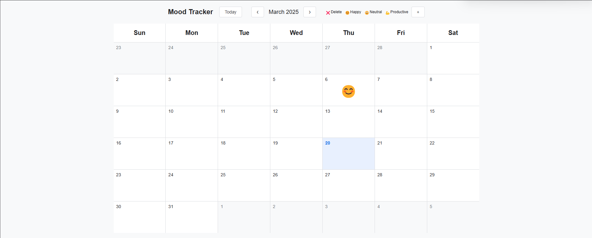
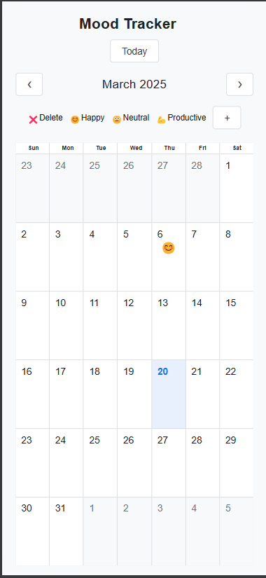

# Mood Tracker

A simple and interactive **Mood Tracker** application.
## Features 🚀
- 📅 **Calendar-based Mood Logging** - Select any date and assign a mood with an emoji.
- 🎨 **Customizable Moods** - Add new moods with unique colors and emojis.
- 📌 **Persistent Data Storage** - Moods are saved in `localStorage` to maintain history.
- 🔥 **Toast Notifications** - Provides quick feedback when actions are performed.
- ⏳ **(Upcoming Feature)** **Timeline View** - View past moods in a **day/week/month-wise** format.

## Screenshots 📸



## Deployment 🌐
[Click here to use the Mood Tracker](https://mood-tracker-gules.vercel.app/)

## Installation & Usage 🛠
1. Clone the repository:
   ```bash
   git clone https://github.com/TheVivekYadav/mood-tracker.git
   cd mood-tracker
   ```
2. Open `index.html` in a browser.
3. Start tracking your moods! 🎭

## Technologies Used 💻
- **HTML, CSS, JavaScript** - Core web technologies.
- **LocalStorage** - For storing user moods persistently.
- **Modular JS** - Components are organized for better maintainability.

## Upcoming Enhancements ✨
- 📊 **Mood Analytics** - Charts showing mood trends.
- 🌎 **Cloud Storage** - Sync moods across devices.
- 📅 **Timeline View** - Display past moods day/week/month-wise (In Progress).

## Contribution 🤝
Feel free to fork this repository, suggest improvements, or contribute new features!
